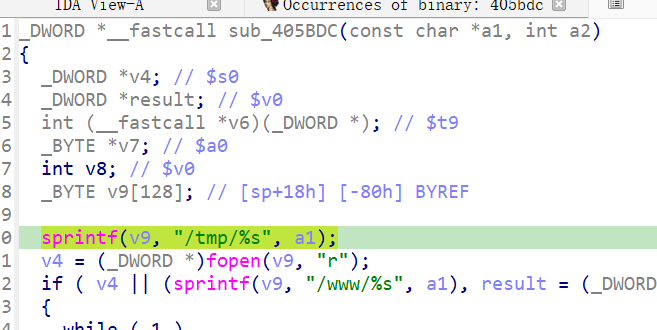

http://www.downloads.netgear.com/files/GDC/XWN5001/XWN5001-V0.4.1.1.zip

漏洞名称：

Netgear XWN5001 0.4.1.1 0x405bdc 缓冲区溢出漏洞

Netgear XWN5001 0.4.1.1 是 Netgear 公司旗下的一款网络设备固件，受影响产品为 XWN5001，受影响版本为 0.4.1.1。

Netgear XWN5001 0.4.1.1 的 `/usr/sbin/uhttpd` 二进制文件中存在一个栈缓冲区溢出漏洞。远程攻击者可以通过发送构造的超长 GET 请求路径触发该问题。程序在处理请求时会把 URI 中的 handler/path 直接传入 `make_funcsjs`，后者在栈上的固定大小缓冲区中使用 `sprintf` 拼接字符串，未对输入长度进行限制，最终覆盖保存寄存器并导致 `uhttpd` 进程崩溃，从而造成拒绝服务。

该漏洞位于二进制文件 `/usr/sbin/uhttpd` 中。请求进入 `handle_request` 后，HTTP 请求行中的URI在 `0x405c24` 调用 `sprintf`写入位于 `sp+0x18` 的局部栈缓冲区。由于该操作没有长度检查，超长路径可覆盖返回状态，并在函数尾声 `0x405cf8` 附近触发崩溃。

攻击者可以远程发起攻击，通过向设备发送包含超长 URI 路径的 GET 请求触发漏洞。本样本中的原始请求以 `GET /.css... HTTP/1.1` 开始，请求路径中携带大量可控字符，符合该漏洞的触发条件。

漏洞研究环境：

通过模拟仿真进行验证。当前附件中的环境是已经 patch 了认证环节之后的，未 patch 的环境可以通过上述下载链接获取对应固件。

通过 greenhouse 进行仿真，greenhouse 链接为 https://github.com/sefcom/greenhouse。仿真环境搭建的具体命令链接为 https://github.com/sefcom/greenhouse/blob/master/MANUAL.md。
我在附件里面附上了 rehost 的镜像，链接为 https://github.com/GinRawin/PoC/blob/main/0417PoC_hf/xwn5001-0.4.1.1/xwn5001-0.4.1.1.tar.gz，启动的命令为进入到 dockerfile 目录下，然后 `docker-compose build`, `docker-compose up`。

目标配置情况：

没有进行特殊配置，默认仿真环境启动。

具体验证过程：

第一步。攻击者向目标设备发送超长 GET 请求，请求路径以 `/` 开头并包含异常长的 handler 名称。`uhttpd` 在 `handle_request` 中读取请求行后，进入函数0x405bdc，其中调用 sprintf(v9, "/tmp/%s", a1); 将URI写入栈缓冲区。由于缓冲区长度固定且不存在边界检查，导致缓冲区溢出。

相关问题代码：

0x405bdc
