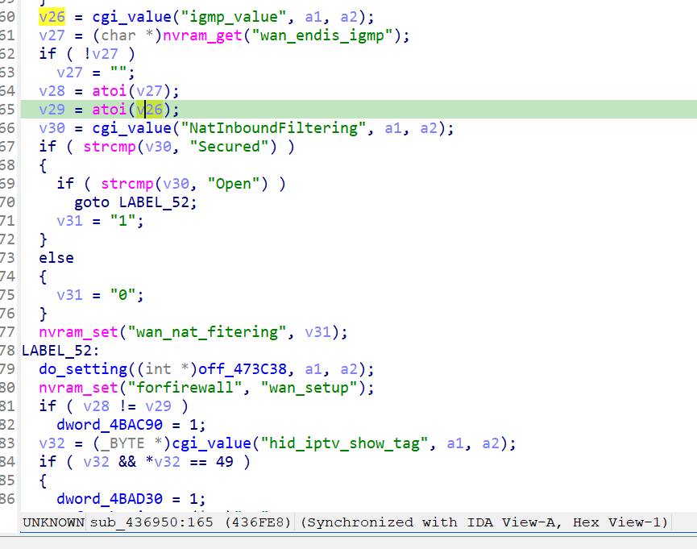

http://www.downloads.netgear.com/files/GDC/XWN5001/XWN5001-V0.4.1.1.zip

漏洞名称：

Netgear XWN5001 0.4.1.1 0x436950 空指针解引用漏洞

Netgear XWN5001 0.4.1.1 是 Netgear 公司旗下的一款网络设备固件，受影响产品为 XWN5001，受影响版本为 0.4.1.1。

Netgear XWN5001 0.4.1.1 的 `/usr/sbin/uhttpd` 二进制文件中存在一个 `NULL 指针解引用` 漏洞。远程攻击者可以通过发送构造的 HTTP 请求触发该问题。wan 处理函数对 cgi_value("igmp_value") 的返回值没有做空指针检查，直接把 NULL 传给了 atoi。

该漏洞位于二进制文件 `/usr/sbin/uhttpd` 中。程序在 `/usr/sbin/uhttpd 0x436950` 处对攻击者可控输入完成读取、解析或传递，并最终在 `/usr/sbin/uhttpd 0x436950` 处进入危险操作，最终导致安全风险。

攻击者可以远程发起攻击，通过向目标设备发送恶意请求触发漏洞。

漏洞研究环境：

通过模拟仿真进行验证。当前附件中的环境是已经 patch 了认证环节之后的，未 patch 的环境可以通过上述下载链接获取对应固件。

通过 greenhouse 进行仿真，greenhouse 链接为 https://github.com/sefcom/greenhouse。仿真环境搭建的具体命令链接为 https://github.com/sefcom/greenhouse/blob/master/MANUAL.md。
我在附件里面附上了 rehost 的镜像，链接为 https://github.com/GinRawin/PoC/blob/main/0417PoC_hf/xwn5001-0.4.1.1/xwn5001-0.4.1.1.tar.gz，启动的命令为进入到 dockerfile 目录下，然后 `docker-compose build`, `docker-compose up`。

目标配置情况：

没有进行特殊配置，默认仿真环境启动。

具体验证过程：

第一步。handle_request调用函数x436fa0，其中调用 v26 = cgi_value("igmp_value", a1, a2);由于请求数据包中不包含igmp_value,因此v26是NULL.接着v29 = atoi(v26);出现空指针解引用

相关问题代码：

0x436950
