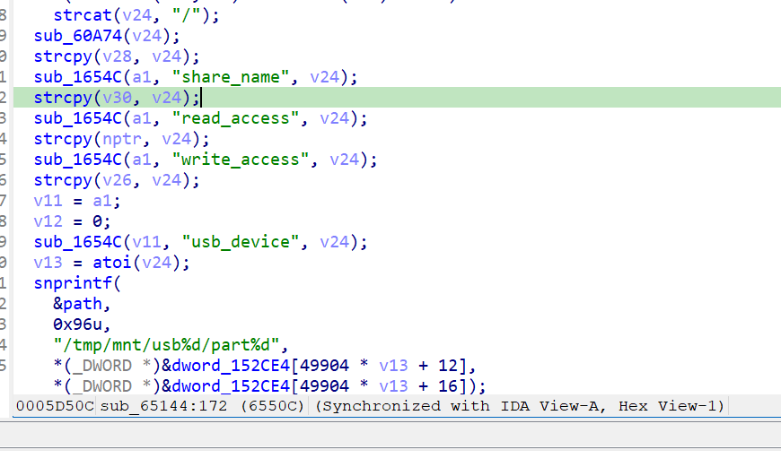

http://www.downloads.netgear.com/files/GDC/AC1450/AC1450-V1.0.0.36_10.0.17.zip
Netgear AC1450-1.0.0.36是Netgear旗下的一款路由器固件，受影响固件名称为AC1450，受影响版本为1.0.0.36。

AC1450_V1.0.0.36_10.0.17
Netgear AC1450-1.0.0.36 httpd 二进制文件包含一个缓冲区溢出漏洞，会导致经过身份验证的远程攻击者能够诱发缓冲区溢出，从而使目标设备dos或执行远程代码。

该漏洞位于二进制文件 usr/sbin/httpd 中，在函数sub_65144在地址 0x6550c 处对strcpy函数的调用。

攻击者可以远程发起攻击，通过发送构造的恶意数据包触发漏洞。

漏洞研究环境：

通过模拟仿真进行验证。当前附件中的环境是已经patch了认证环节之后的，未patch的环境可以用binwalk解压对应下载链接的固件得到。

通过greenhouse进行仿真，greenhouse链接为https://github.com/sefcom/greenhouse。仿真环境搭建的具体命令链接为https://github.com/sefcom/greenhouse/blob/master/MANUAL.md。
我在附件里面附上了rehost的镜像，启动的命令为进入到dockerfile目录下，然后docker-compose build, docker-compose up。

我还附上了我发包用的脚本，使用方式为python3 send.py + 文件名。

目标配置情况：

没有进行特殊配置，默认仿真环境启动。

具体验证过程：

第一步。攻击者发送一个恶意数据包，路由信息为usb_device.cgi，函数sub_65144将数据包中share_name参数的值传播到传播到strcpy中，这会导致缓冲区溢出，数据包内容如下：

相关问题代码：

sub_65144
