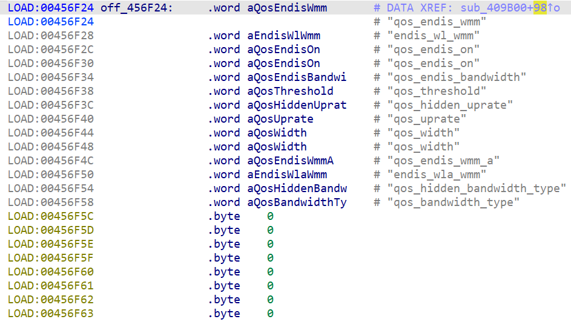

# Overview

- Manufacturer's website information：https://www.netgear.com/
- Firmware download address ：https://www.netgear.com/support/download/?model=WNCE4004

# Affected version

WNCE4004 1.0.0.34 and before

# Vulnerability description

A buffer overflow exists in the NETGEAR WNCE4004 router (firmware V1.0.0.34 and before).By accessing the `apply_qos` page, users can pass the payload to the `endis_wl_wmm` configuration item through the `qos_endis_wmm` parameter, which will cause a buffer overflow when accessing this path again. As a result, an attacker could cause a denial of service or potentially remote code execution.

# Vulnerability location

The call to strcpy at address `0x409B54` in the function `sub_409B00`. 

# Vulnerability Reproduction Steps

Environment :

Verification was conducted through simulation. The rehost environment is [wnce4004_patched_env.tar.gz](https://github.com/GinRawin/PoC/blob/main/Netgear/wnce4004/wnce4004_patched_env.tar.gz). This is a simulation result based on [Greenhouse](https://github.com/sefcom/greenhouse)).The operating system used for reproduction is Ubuntu 22 (other environments that can use docker-compose should also work).

Reproduction steps:

1. Navigate to the debug directory in the simulation environment and start the rehost environment using the commands `docker-compose build` and `docker-compose up`.

2. Trigger the vulnerability by sending packages. I have attached the package sending script [send.py](https://github.com/GinRawin/PoC/blob/main/Netgear/wnce4004/send.py) and data packages [package1.json](https://github.com/GinRawin/PoC/blob/main/Netgear/wnce4004/0x409B54/package1.json), [package2.json](https://github.com/GinRawin/PoC/blob/main/Netgear/wnce4004/0x409B54/package1.json). The usage is `python3 send.py xxx`. If there are multiple data packages input, repeat this step to send multiple data packages.

For detailed reproduction instructions, please refer to my attached [video](https://github.com/GinRawin/PoC/blob/main/Netgear/wnce4004/0x409B54/DemonstrationProcess.mp4)

# Vulnerability Details

1. Send the package1, setting the routing information to `apply.cgi`, which allows entry into the function `sub_409B00`. This function calls the `do_setting` function. This function extracts the value of `qos_endis_wmm` from the package and sets it as the value of `endis_wl_wmm` according to the `off_456F24`. 

2. Send the package2, setting the routing information to `apply.cgi`, which enters the function `sub_409B00`. This function propagates the value of `endis_wl_wmm` into the `strcpy` function, **causing a buffer overflow**. 

