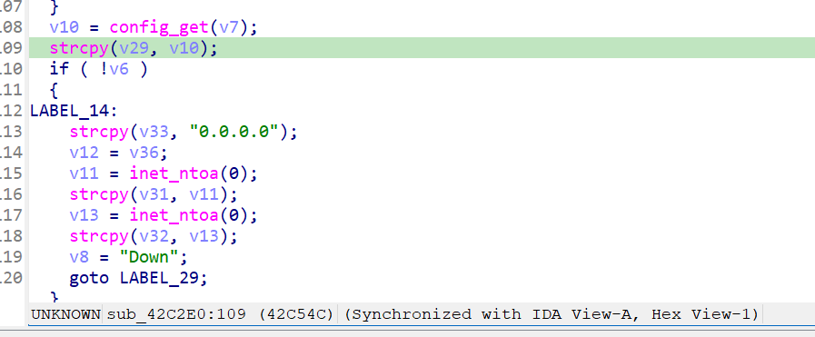

# Overview

- Manufacturer's website information：https://www.netgear.com/
- Firmware download address ：https://www.netgear.com/support/download/?model=WNCE4004

# Affected version

WNCE4004 1.0.0.34 and before

# Vulnerability description

A buffer overflow exists in the NETGEAR WNCE4004 router (firmware V1.0.0.34 and before).By accessing the `SetMaxMTUSize` page, users can pass the payload to the `wan_dhcp_mtu` configuration item through the `NewMaxMTUSize` parameter, which will cause a bugger overflow when accessing the page `GetInfo`. As a result, an attacker could cause a denial of service or potentially remote code execution.

# Vulnerability location

The call to strcpy at address `0x42C54C` in the function `sub_42C2E0`. 

# Vulnerability Reproduction Steps

Environment :

Verification was conducted through simulation. The rehost environment is [wnce4004rehosted.tar.gz](../wnce4004rehosted.tar.gz). This is a simulation result based on [Greenhouse](https://github.com/sefcom/greenhouse).The operating system used for reproduction is Ubuntu 22 (other environments that can use docker-compose should also work).

Reproduction steps:

1. Navigate to the debug directory in the simulation environment and start the rehost environment using the commands `docker-compose build` and `docker-compose up`.

2. Trigger the vulnerability by sending packages. I have attached the package sending script [send.py](../send.py) and data packages [package1.raw](package1.raw), [package2.raw](package2.raw),[package3.raw](package3.raw). The usage is `python3 send.py xxx`. If there are multiple data packages input, repeat this step to send multiple data packages.

For detailed reproduction instructions, please refer to my attached [video](DemonstrationProcess.mp4)

# Vulnerability Details

1. Send the first data packet. In function `ExecuteSoapAction`, the parameter `DeviceConfig:#ConfigurationStarted` will  call the function `sub_42ACB4` based on `off_458190` in `SOAPActions`, which will set the value of `config_state` to 1.

2. Send the second data packet. In function `ExecuteSoapAction`, the parameter `WANIPConnection:#SetMaxMTUSize` will call the function `sub_42C9C8` based on `off_458430`  in `SOAPActions`. Because the value of `config_state` is 1 and the value of `wan_proto` is not `"pptp"`, `"l2tp"`, or `"pppoe"`, the value of `wan_dhcp_mtu` is set to the `NewMaxMTUSize` value from the packet.

3. Send the third data packet. In function `ExecuteSoapAction`, the parameter `WANIPConnection:#GetInfo` will call the function `sub_42C2E0` based on `off_458430`  in `SOAPActions`.  Finally, upon reaching address `0x42C54C`, the call to the `strcpy` function **triggered a buffer overflow.**

