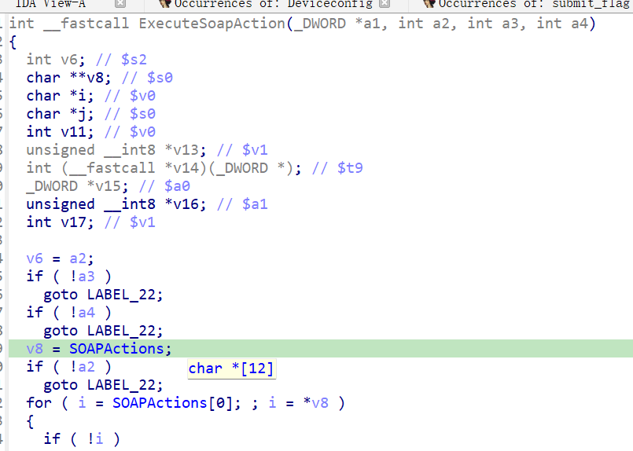
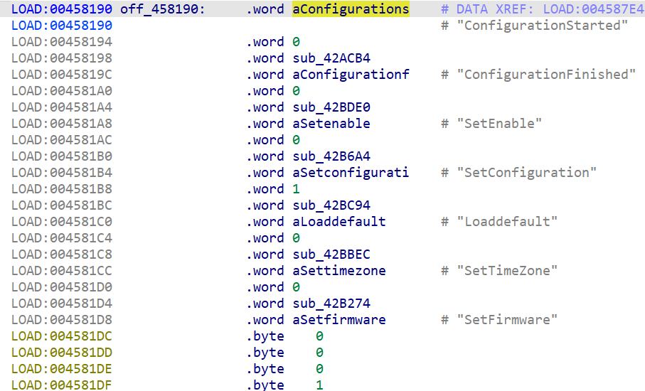

# Overview

- Manufacturer's website information：https://www.netgear.com/
- Firmware download address ：https://www.netgear.com/support/download/?model=WNCE4004

# Affected version

WNCE4004 1.0.0.34 and before

# Vulnerability description

A buffer overflow exists in the NETGEAR WNCE4004 router (firmware V1.0.0.34 and before).By accessing the `lan` page, users can pass the payload to the `lan_ipaddr` configuration item through the `ether_ipaddr` parameter, which will cause a bugger overflow when accessing the page `SetIPInterfaceInfo`. As a result, an attacker could cause a denial of service or potentially remote code execution.

# Vulnerability location

The call to strcpy at address `0x42D120` in the function `sub_42CE44`. 

# Vulnerability Reproduction Steps

Environment :

Verification was conducted through simulation. The rehost environment is [wnce4004rehosted.tar.gz](https://github.com/GinRawin/PoC/blob/main/Netgear/wnce4004/wnce4004rehosted.tar.gz). This is a simulation result based on [Greenhouse](https://github.com/sefcom/greenhouse).The operating system used for reproduction is Ubuntu 22 (other environments that can use docker-compose should also work).

Reproduction steps:

1. Navigate to the debug directory in the simulation environment and start the rehost environment using the commands `docker-compose build` and `docker-compose up`.

2. Trigger the vulnerability by sending packages. I have attached the package sending script [send.py](https://github.com/GinRawin/PoC/blob/main/Netgear/wnce4004/send.py) and data packages [package1.raw](https://github.com/GinRawin/PoC/blob/main/Netgear/wnce4004/0x42D120/package1.raw), [package2.raw](https://github.com/GinRawin/PoC/blob/main/Netgear/wnce4004/0x42D120/package2.raw),[package3.raw](https://github.com/GinRawin/PoC/blob/main/Netgear/wnce4004/0x42D120/package3.raw). The usage is `python3 send.py xxx`. If there are multiple data packages input, repeat this step to send multiple data packages.

For detailed reproduction instructions, please refer to my attached [video](https://github.com/GinRawin/PoC/blob/main/Netgear/wnce4004/0x42D120/DemonstrationProcess.mp4)

# Vulnerability Details

1. Send the first data packet, set `submit_flag=lan` to enter the function `sub_40AC4C`, set `change_wan_type=0`, and thus the program calls the function `do_setting`. Based on the contents of `off_45713C`, extract the value of `ether_ipaddr` from the packet and assign it to `lan_ipaddr`.

2. Send the second data packet, in `SOAPAction`, set the parameter `DeviceConfig:#ConfigurationStarted` to enter the function `ExecuteSoapAction`, which then calls the function `sub_42ACB4` based on `off_458190`, setting the value of `config_state` to 1.

3. Send the third data packet, in `SOAPAction`, set the parameter `WANIPConnection:#SetIPInterfaceInfo` to enter the function `ExecuteSoapAction`, which then calls the function `sub_42CE44` based on `off_458430`. Since the value of `config_state` is 1, the program is able to reach the `0x42D120` location and propagate the value of `lan_ipaddr` to the `sprintf` function.

