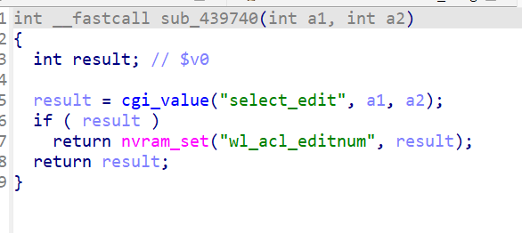
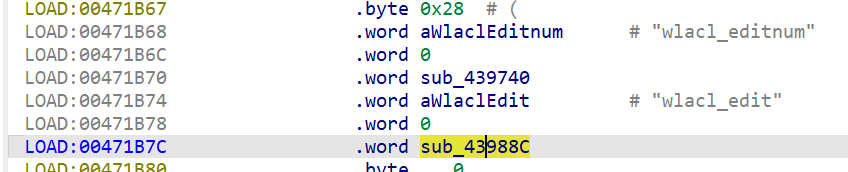
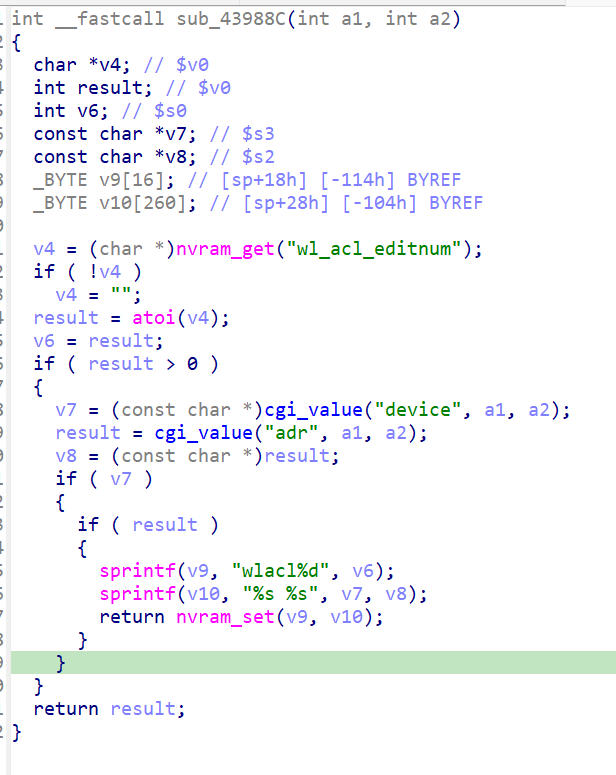
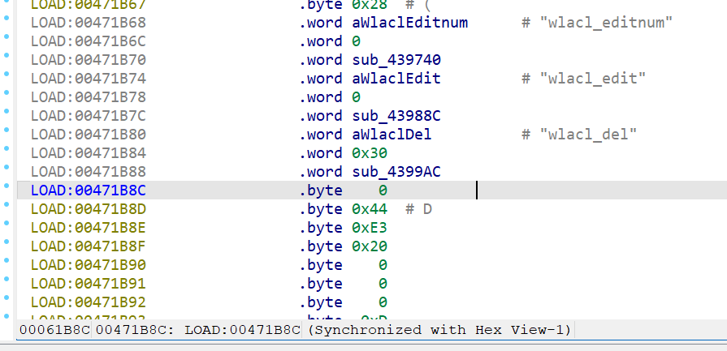
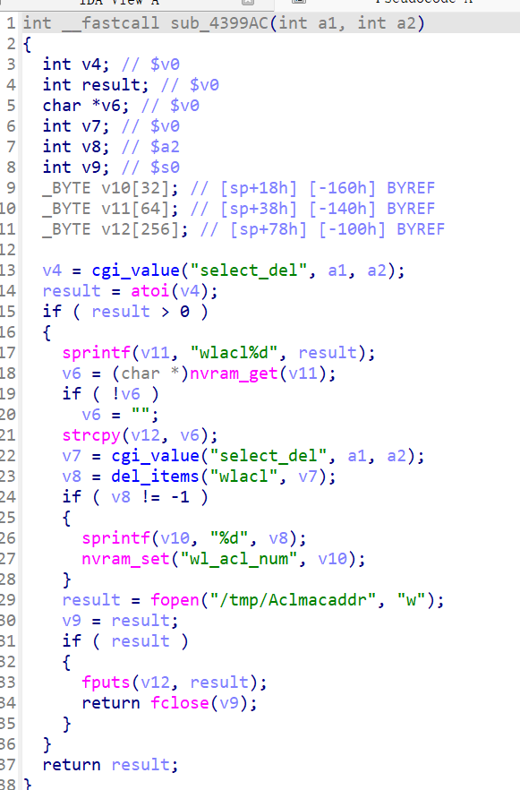
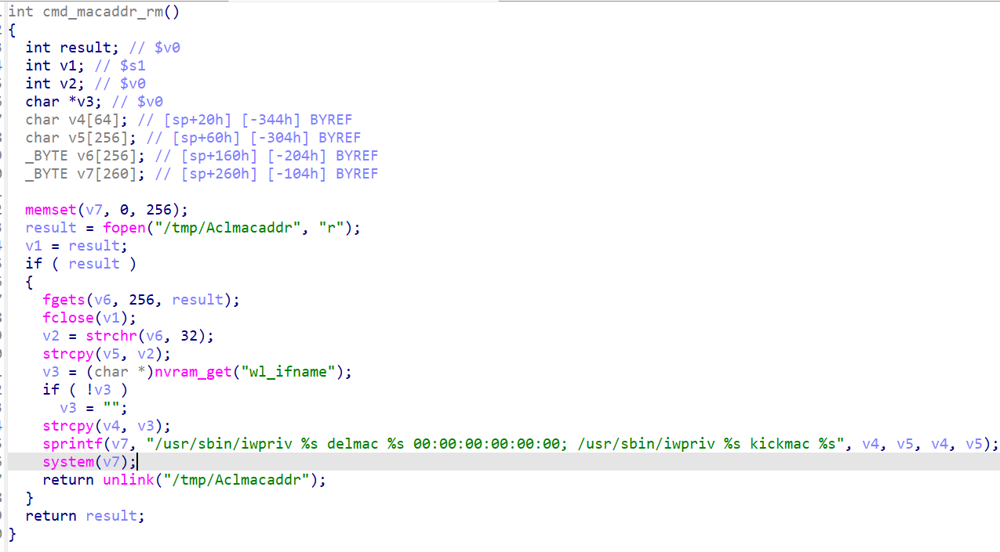

# Overview

- Manufacturer's website information：https://www.netgear.com/
- Firmware download address ：https://www.netgear.com/support/product/xwn5001/.

# Affected version

xwn5001-0.4.1.1

# Vulnerability description

The Netgear xwn5001-0.4.1.1 uhttpd binary contains a OS Command Injection vulnerability, allowing unauthenticated remote attackers to inject arbitrary OS commands and execute them on the server.

# Vulnerability location

The call to strcpy at address `0x40F7C8` in the function `cmd_macaddr_rm`. 

# Vulnerability Reproduction Steps

Environment :

Verification was conducted through simulation. The rehost environment is [xwn5001rehosted.tar.gz](../xwn5001rehosted.tar.gz). This is a simulation result based on [Greenhouse](https://github.com/sefcom/greenhouse).The operating system used for reproduction is Ubuntu 22 (other environments that can use docker-compose should also work).

Reproduction steps:

1. Navigate to the debug directory in the simulation environment and start the rehost environment using the commands `docker-compose build` and `docker-compose up`.

2. Trigger the vulnerability by sending packages. I have attached the package sending script [send.py](../send.py) and data packages [package1.raw](package1.raw), [package2.raw](package2.raw),[package3.raw](package3.raw). The usage is `python3 send.py xxx`. If there are multiple data packages input, repeat this step to send multiple data packages.

For detailed reproduction instructions, please refer to my attached [video](DemonstrationProcess.mp4)

# Vulnerability Details

1. After sending the first data packet, since the value of `submit_flag` is `wlacl_editnum`, the program calls `sub_439740` via the `off_4718B0` function table in the `cgi_setobject` function. In `sub_439740`, the program extracts the value of `select_edit` from the packet and assigns it to `wl_acl_editnum`. Therefore, after the packet is sent, the value of `wl_acl_editnum` becomes 123.

2. After sending the second data packet, since the value of `submit_flag` is `wlacl_edit`, the program calls `sub_43988C` via the `off_4718B0` function table in the `cgi_setobject` function. In `sub_43988C`, the program obtains a variable based on the value of `wl_acl_editnum`, namely `wlacl123`, and then extracts the values corresponding to `device` and `addr` from the packet and stores them into `wlacl123`. That is, the value of `wlacl123` is "1111111 \`echo 1233 >/poc`".

3. After sending the third data packet, since the value of `submit_flag` is `wlacl_del`, the program calls `sub_4399AC` via the `off_4718B0` function table in the `cgi_setobject` function. In `sub_4399AC`, the program retrieves the value of `select_del` from the packet and concatenates it to form a variable, i.e., `wlacl123`. It then reads the value corresponding to `wlacl123`—the value stored in step 2, "1111111 \`echo 1233 >/poc\`", and writes it into the file `/tmp/Aclmacaddr`. Afterwards, execution reaches the function `cmd_macaddr_rm`, where the substring after the space in `/tmp/Aclmacaddr`is assigned to`v6`and then written into`v7`. As a result, `v7`becomes "/usr/sbin/iwpriv %s delmac \`echo 123 >/poc\` 00:00:00:00:00:00; /usr/sbin/iwpriv %s kickmac \`echo 123 >/poc\`". Therefore, when the system executes it, the command `echo 123 >/poc` will be executed, triggering a command injection attack.

