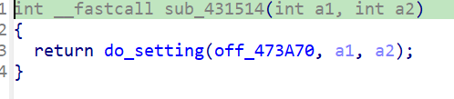
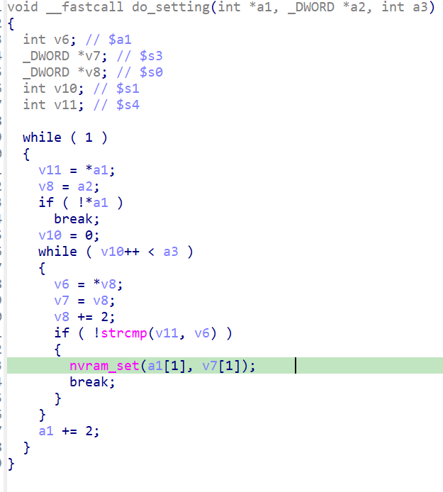
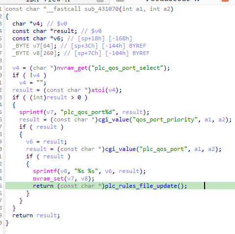
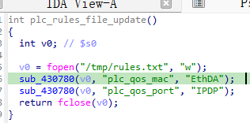
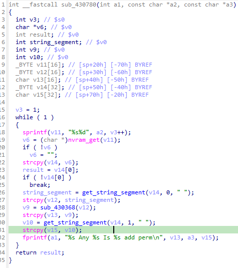

# Overview

- Manufacturer's website information：https://www.netgear.com/
- Firmware download address ：https://www.netgear.com/support/product/xwn5001/.

# Affected version

xwn5001-0.4.1.1

# Vulnerability description

The Netgear xwn5001-0.4.1.1 uhttpd binary contains a null-pointer-dereference vulnerability. When a specific network packet is sent to the uhttpd binary, the strcpy operation crashes, resulting in a denial of service. This vulnerability can be exploited by a local or remote unauthenticated attacker.

# Vulnerability location

The call to strcpy at address `0x4310BC` in the function `sub_430780`. 

# Vulnerability Reproduction Steps

Environment :

Verification was conducted through simulation. The rehost environment is [xwn5001rehosted.tar.gz](../xwn5001rehosted.tar.gz). This is a simulation result based on [Greenhouse](https://github.com/sefcom/greenhouse).The operating system used for reproduction is Ubuntu 22 (other environments that can use docker-compose should also work).

Reproduction steps:

1. Navigate to the debug directory in the simulation environment and start the rehost environment using the commands `docker-compose build` and `docker-compose up`.

2. Trigger the vulnerability by sending packages. I have attached the package sending script [send.py](../send.py) and data packages [package1.raw](package1.raw), [package2.raw](package2.raw). The usage is `python3 send.py xxx`. If there are multiple data packages input, repeat this step to send multiple data packages.

For detailed reproduction instructions, please refer to my attached [video](DemonstrationProcess.mp4)

# Vulnerability Details

1. After sending the first data packet, since the value of `submit_flag` is `plc_qos_dev_port_config`, the program calls `sub_431514` via the `off_4718B0` function table in the `cgi_setobject` function. In `sub_431514`, the program calls fucntion `do_setting` and sets the value of `plc_qos_port_select` from the packet and saves it in variance `plc_qos_port_select` according to `off_473A70`. 

2. After sending the second data packet, since the value of `submit_flag` is `plc_qos_port_edit`, the program calls `sub_431070` via the `off_4718B0` function table in the `cgi_setobject` function.  `sub_431070` calls function `plc_rules_file_update` and enters fucntion `sub_430780`. In this function, `v14` is an empty string so `v10` is a null pointer. Finally it causes an null pointer dereference.

