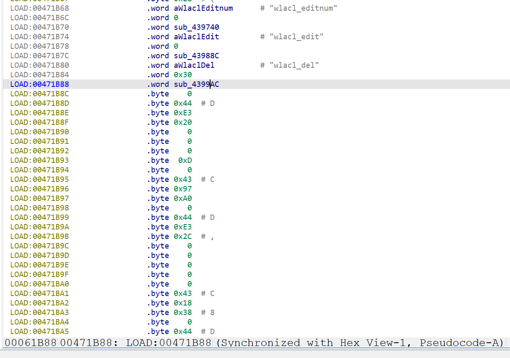
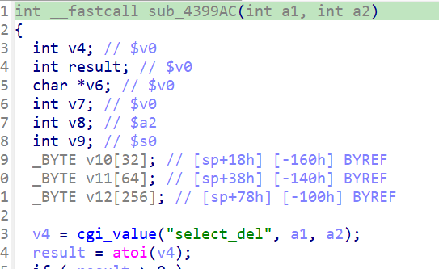

# Overview

- Manufacturer's website information：https://www.netgear.com/
- Firmware download address ：https://www.netgear.com/support/product/xwn5001/.

# Affected version

xwn5001-0.4.1.1

# Vulnerability description

The Netgear xwn5001-0.4.1.1 uhttpd binary contains a null-pointer-dereference vulnerability. When a specific network packet is sent to the uhttpd binary, the atoi operation crashes, resulting in a denial of service. This vulnerability can be exploited by a local or remote unauthenticated attacker.

# Vulnerability location

The call to strcpy at address `0x4399F4` in the function `sub_4399AC`. 

# Vulnerability Reproduction Steps

Environment :

Verification was conducted through simulation. The rehost environment is [xwn5001rehosted.tar.gz](../xwn5001rehosted.tar.gz). This is a simulation result based on [Greenhouse](https://github.com/sefcom/greenhouse).The operating system used for reproduction is Ubuntu 22 (other environments that can use docker-compose should also work).

Reproduction steps:

1. Navigate to the debug directory in the simulation environment and start the rehost environment using the commands `docker-compose build` and `docker-compose up`.

2. Trigger the vulnerability by sending packages. I have attached the package sending script [send.py](../send.py) and data packages [package1.raw](package1.raw). The usage is `python3 send.py xxx`. If there are multiple data packages input, repeat this step to send multiple data packages.

For detailed reproduction instructions, please refer to my attached [video](DemonstrationProcess.mp4)

# Vulnerability Details

1. After sending the first data packet, since the value of `submit_flag` is `wlacl_del`, the program calls `sub_4399AC` via the `off_4718B0` function table in the `cgi_setobject` function. In `sub_4399AC`, the program extracts the value of `select_del` from the packet. The program directly passes the `select_del` pointer to the `atoi` function without checking if it is null, leading to a null pointer dereference.

