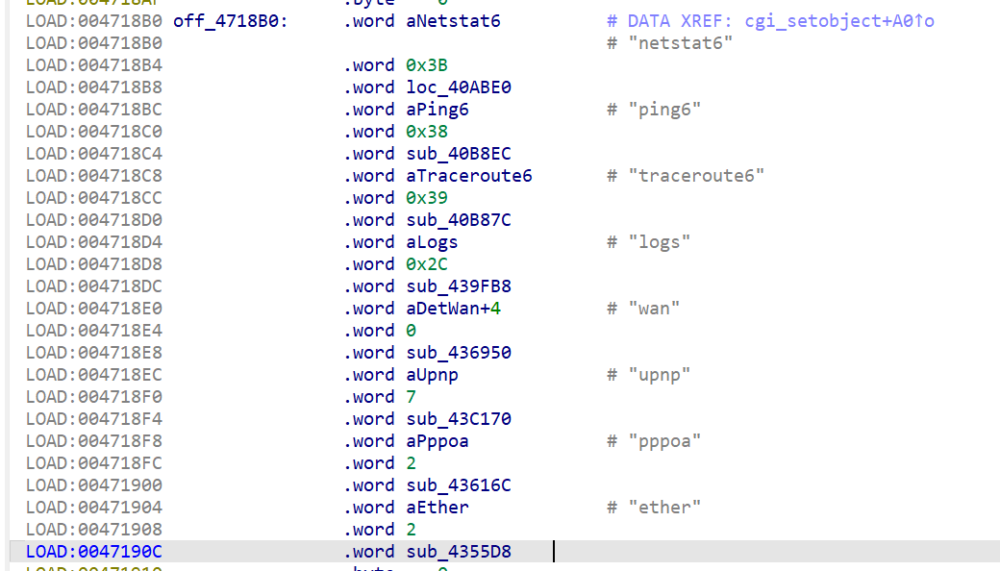
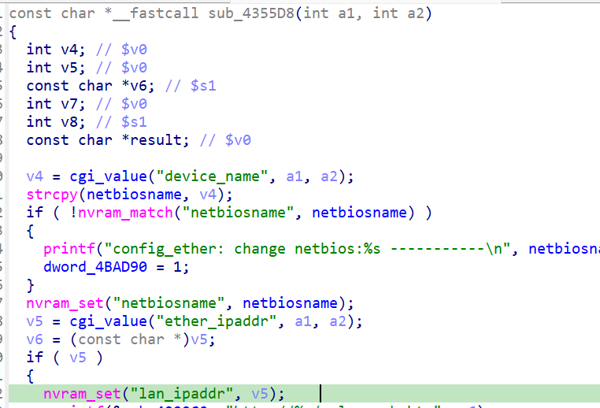
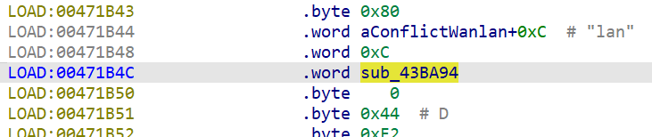
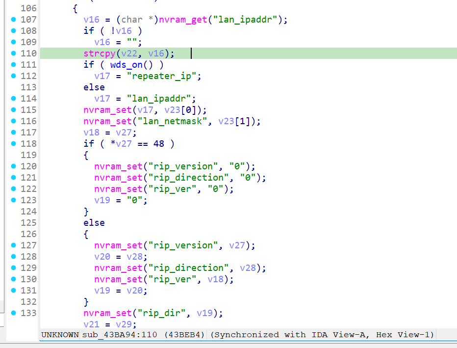

# Overview

- Manufacturer's website information：https://www.netgear.com/
- Firmware download address ：https://www.netgear.com/support/product/xwn5001/.

# Affected version

xwn5001-0.4.1.1

# Vulnerability description

The Netgear xwn5001-0.4.1.1 uhttpd binary contains a OS Command Injection vulnerability, allowing unauthenticated remote attackers to inject arbitrary OS commands and execute them on the server.

# Vulnerability location

The call to strcpy at address `0x43BEB4` in the function `cmd_macaddr_rm`. 

# Vulnerability Reproduction Steps

Environment :

Verification was conducted through simulation. The rehost environment is [xwn5001rehosted.tar.gz](../xwn5001rehosted.tar.gz). This is a simulation result based on [Greenhouse](https://github.com/sefcom/greenhouse).The operating system used for reproduction is Ubuntu 22 (other environments that can use docker-compose should also work).

Reproduction steps:

1. Navigate to the debug directory in the simulation environment and start the rehost environment using the commands `docker-compose build` and `docker-compose up`.

2. Trigger the vulnerability by sending packages. I have attached the package sending script [send.py](../send.py) and data packages [package1.raw](package1.raw), [package2.raw](package2.raw),[package3.raw](package3.raw). The usage is `python3 send.py xxx`. If there are multiple data packages input, repeat this step to send multiple data packages.

For detailed reproduction instructions, please refer to my attached [video](DemonstrationProcess.mp4)

# Vulnerability Details

1. After sending the first data packet, since the value of `submit_flag` is `ether`, the program calls `sub_4355D8` via the `off_4718B0` function table in the `cgi_setobject` function. In `sub_4355D8`, the program extracts the value of `ether_ipaddr` from the packet and assigns it to `lan_ipaddr`. 

2. After sending the second data packet, since the value of `submit_flag` is `lan`, the program calls `sub_43BA94` via the `off_4718B0` function table in the `cgi_setobject` function. In `sub_43BA94`, the value of `lan_ipaddr` is conveyed to strcpy function, which results in a buffer overflow.

