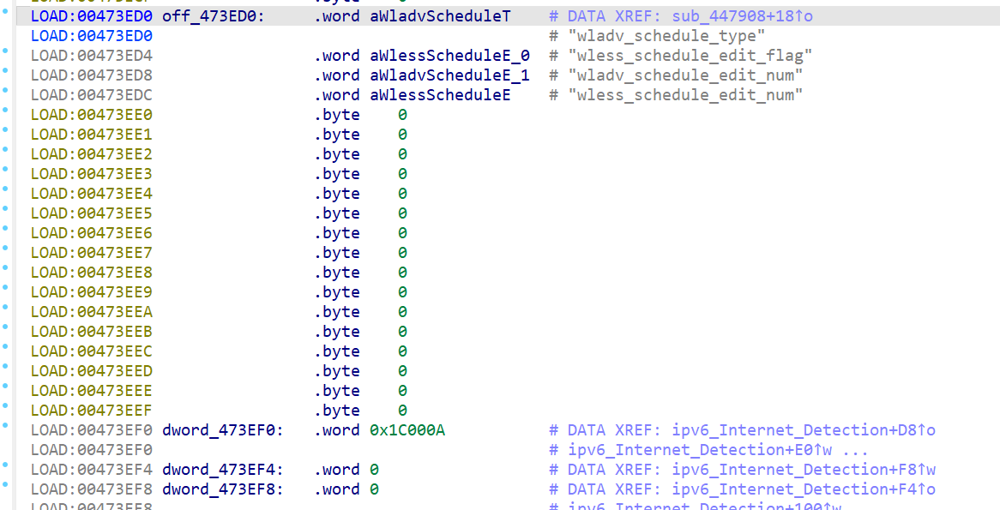
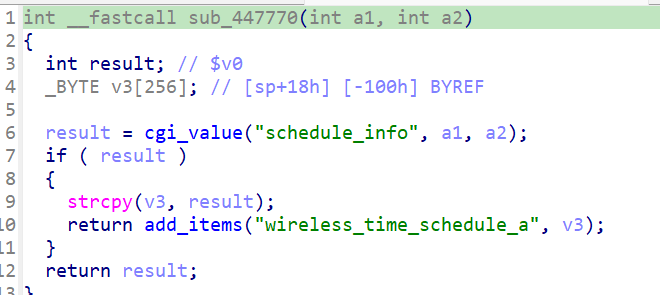

# Overview

- Manufacturer's website information：https://www.netgear.com/
- Firmware download address ：https://www.netgear.com/support/product/xwn5001/.

# Affected version

xwn5001-0.4.1.1

# Vulnerability description

A buffer overflow exists in the NETGEAR xwn5001-0.4.1.1. As a result, an attacker could cause a denial of service or potentially remote code execution.

# Vulnerability location

The call to strcpy at address `0x447658` in the function `sub_447770`. 

# Vulnerability Reproduction Steps

Environment :

Verification was conducted through simulation. The rehost environment is [xwn5001rehosted.tar.gz](../xwn5001rehosted.tar.gz). This is a simulation result based on [Greenhouse](https://github.com/sefcom/greenhouse).The operating system used for reproduction is Ubuntu 22 (other environments that can use docker-compose should also work).

Reproduction steps:

1. Navigate to the debug directory in the simulation environment and start the rehost environment using the commands `docker-compose build` and `docker-compose up`.

2. Trigger the vulnerability by sending packages. I have attached the package sending script [send.py](../send.py) and data packages [package1.raw](package1.raw), [package2.raw](package2.raw). The usage is `python3 send.py xxx`. If there are multiple data packages input, repeat this step to send multiple data packages.

For detailed reproduction instructions, please refer to my attached [video](DemonstrationProcess.mp4)

# Vulnerability Details

1. After sending the first data packet, since the value of `submit_flag` is `wireless_schedule_select_to_edit`, the program calls `sub_447908` via the `off_4718B0` function table in the `cgi_setobject` function. In `sub_447908`,the program calls fucntion `do_setting` and sets the value of `wladv_schedule_edit_num` from the packet and saves it in variance `wladv_schedule_edit_num` according to `off_473ED0`. 

2. After sending the second data packet, since the value of `submit_flag` is `wadv_schedule_edit_an`, the program calls `sub_447770` via the `off_4718B0` function table in the `cgi_setobject` function. In `sub_447770`, the program  extracts value of `schedule_info` from the package and propagates its value to `strcpy` function, which causes a buffer overflow.

